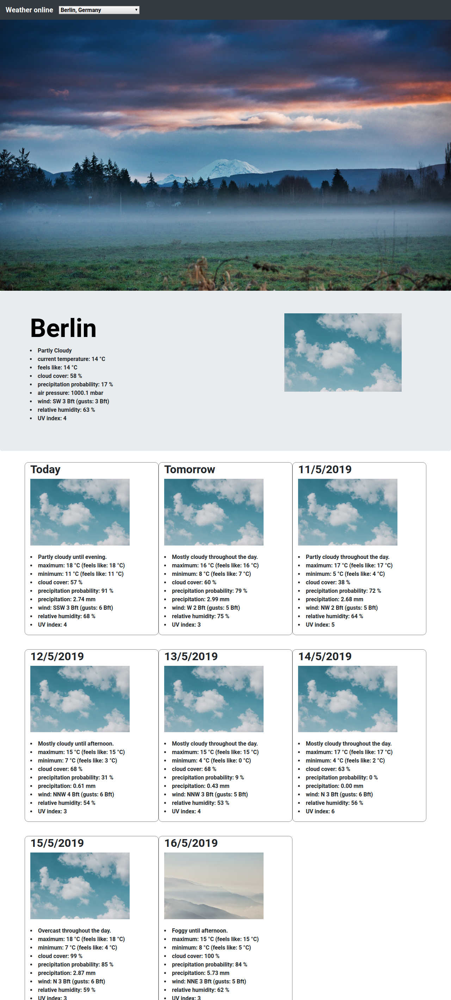

# JS-weather

This webpage was created by Stefan Klinkusch at Digital Career Institute in Berlin, Germany using HTML, SCSS, Bootstrap, Webpack, and vanilla JavaScript. It fetches weather data for a given city from the [DarkSky API](https://api.darksky.net/forecast) and prints it to the DOM

## Features

The webpage features
- a header containing a dropdown menu with the cities
- a jumbotron section with the current weather
  - name of the city
  - description of the weather
  - current temperature as well as the "feels like" temperature according to the wind chill effect/heat index
  - the cloud cover in percent
  - the precipitation probability in percent
  - the air pressure
  - the wind direction and speed (average and gusts)
  - the relative humidity of the air
  - the current UV index
  - an image showing the weather state
- eight image cards for the current day and the next week
  - an image showing the weather state
  - description of the weather
  - maximum and minimum temperature (also "feels like" temperature)
  - cloud cover
  - precipitation probability
  - daily precipitation
  - wind direction and speed (average and gusts)
  - relative humidity
  - UV index

## Screenshot

